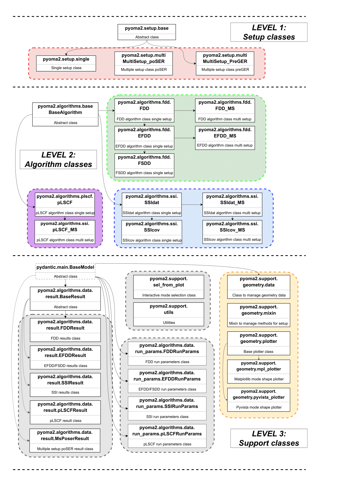

# pyOMA2


[](https://www.python.org)
[](https://github.com/pre-commit/pre-commit)
[](https://github.com/dagghe/pyOMA2/actions/workflows/main.yml)

[](https://pyoma.readthedocs.io/en/main/)
[](https://doi.org/10.21105/joss.07656)
_______________________

This is the new and updated version of pyOMA module, a Python module designed for conducting operational modal analysis.
With this update, we've transformed pyOMA from a basic collection of functions into a more sophisticated module that fully leverages the capabilities of Python classes.

Key Features & Enhancements:

- Support for single and multi-setup measurements, which includes handling multiple acquisitions with mixed reference and roving sensors.
- Interactive plots for intuitive mode selection, users can now extract desired modes directly from algorithm-generated plots.
- Structure geometry definition, enabling 3D visualization of mode shapes once modal results are obtained.
- Uncertainty estimation for modal properties in Stochastic Subspace Identification (SSI) algorithms.
- Specialized clustering classes for Automatic OMA using SSI, streamlining modal parameter extraction.
- New OMAX (OMA with Exogenous Input) functionality for SSI, expanding the module’s capabilities to handle forced excitation scenarios.

## Documentation

You can check the documentation at the following link:

https://pyoma.readthedocs.io/en/main/

## Quick start

Install the library with pip:

```shell
pip install pyOMA-2
```

or with conda/mamba:

```shell
conda install pyOMA-2
```

You'll probably need to install **tk** for the GUI on your system, here some instructions:

Windows:

https://www.pythonguis.com/installation/install-tkinter-windows/

Linux:

https://www.pythonguis.com/installation/install-tkinter-linux/

Mac:

https://www.pythonguis.com/installation/install-tkinter-mac/

## Docker (Recommended for isolated environment)

Run pyOMA2 in a container with **all dependencies pre-installed** - no local Python setup needed, just Docker.

### Build the image

```shell
docker compose build
```

### Run Jupyter Notebook

```shell
docker compose up jupyter
```

Then open `http://localhost:8888` in your browser (no token required for local development).

**Docker Limitations:**

- Interactive Qt windows (`pyvistaqt`) not available - use `notebook=True` for 3D plots and `save_gif=True` for animations
- Authentication disabled for convenience - only use on trusted networks

### Run Python shell

```shell
docker compose up pyoma2
```

### Run a command in the container

```shell
docker compose run --rm pyoma2 python3 your_script.py
```

### Enter interactive shell

```shell
docker compose run --rm pyoma2 /bin/bash
```

### GUI Applications (Optional)

For 3D visualizations and interactive plots, enable X11 forwarding:

**Linux:**
```shell
xhost +local:docker
docker compose up pyoma2
```

**macOS:**
```shell
# Install XQuartz first: brew install --cask xquartz
xhost +localhost
docker compose up pyoma2
```

**Windows/WSL2:**
```shell
# Install VcXsrv or Xming, then:
export DISPLAY=$(cat /etc/resolv.conf | grep nameserver | awk '{print $2}'):0
docker compose up pyoma2
```

_______________________

# Examples

To see how the module works please take a look at the jupyter notebook provided:

- [Example1 - Getting started.ipynb](Examples/Example1.ipynb)
- [Example2 - Real dataset.ipynb](Examples/Example2.ipynb)
- [Example3 - Multisetup PoSER.ipynb](Examples/Example3.ipynb)
- [Example4 - MultiSetup PreGER.ipynb](Examples/Example4.ipynb)
- [Example5 - Clustering for Automatic OMA.ipynb](Examples/Example5.ipynb)
- [Extra - Tips and Tricks 1.ipynb](Examples/Extra1.ipynb)

_____

# Schematic organisation of the module showing inheritance between classes



____

_______________________

## How to Cite

If you use pyOMA2 in your research, please cite our JOSS paper:

**BibTeX:**
```bibtex
@article{Pasca2025,
  doi = {10.21105/joss.07656},
  url = {https://doi.org/10.21105/joss.07656},
  year = {2025},
  publisher = {The Open Journal},
  volume = {10},
  number = {115},
  pages = {7656},
  author = {Pasca, Dag P. and Margoni, Diego Federico},
  title = {pyOMA2: A Python module for conducting operational modal analysis},
  journal = {Journal of Open Source Software}
}
```

**APA:**
```
Pasca, D. P., & Margoni, D. F. (2025). pyOMA2: A Python module for conducting operational modal analysis. Journal of Open Source Software, 10(115), 7656. https://doi.org/10.21105/joss.07656
```

_______________________
